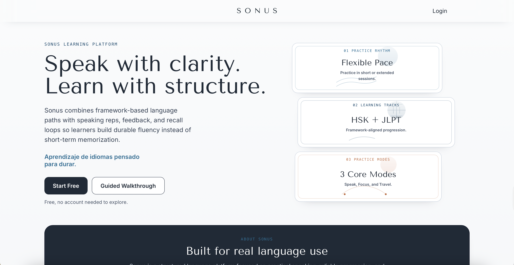
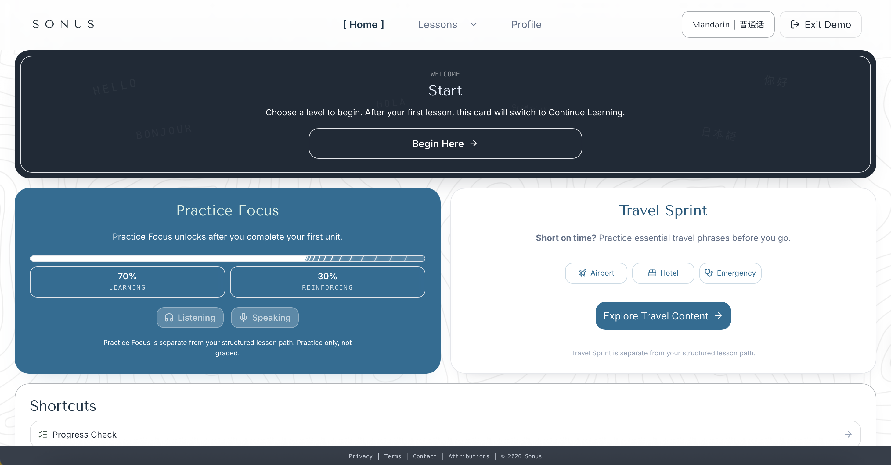
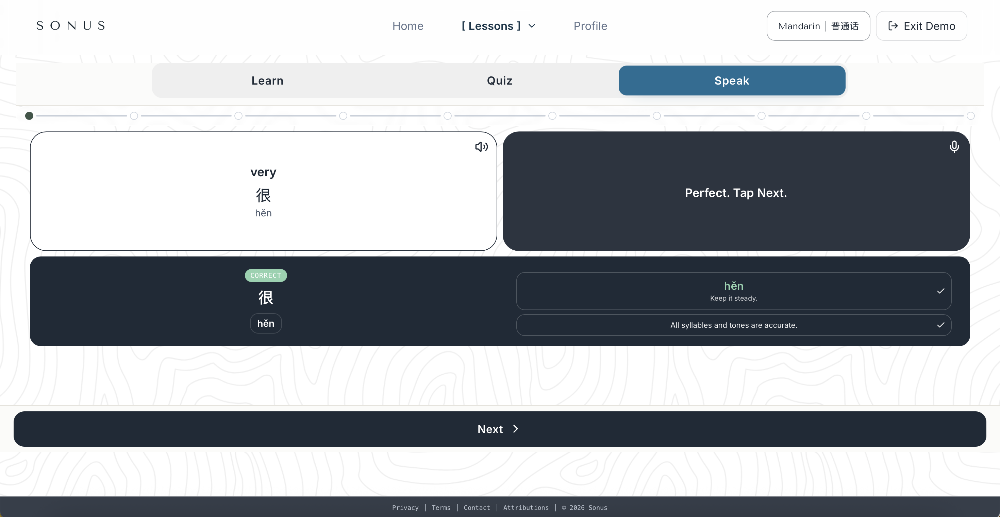

# Sonus

Sonus is a structured language-learning platform focused on durable fluency through speaking practice, proficiency-aligned progression, and practical travel-first learning.

## What Is This?
Sonus is a full-stack language-learning app in this monorepo:
- Frontend: `sonus-react/` (React + Vite + TypeScript)
- Backend: `backend/` (Fastify + Prisma + PostgreSQL)

Primary public surface: `https://sonuslearning.com/`

## Why Sonus
Sonus exists to close the gap between vocabulary study and actually speaking in context. The product emphasizes:
- Structured curriculum progression (HSK/JLPT aligned bands)
- Active recall over passive review
- Pronunciation practice with immediate feedback
- Practical travel-first phrase training

## Current Features
- Mandarin track with banded progression and review queues
- Japanese track with JLPT-style levels (`n5` to `n1`)
- Core study loop: Learn, Quiz, Speak, Apply
- Weak-word detection and spaced review scheduling
- Progress resume flow from home dashboard
- Travel mode for phrase-first drills
- Public landing + auth pages
- Account/profile management

## Tech Stack
- Frontend: React 19, Vite 7, TypeScript, Tailwind CSS
- Backend: Fastify 5, Prisma, TypeScript
- Database: PostgreSQL
- Tooling: npm workspaces, Vitest, Playwright

## Local Development
Prerequisites:
- Node.js 20+
- npm 10+
- PostgreSQL (local install or Docker)

Setup:
```bash
npm install
cp backend/.env.example backend/.env
cp sonus-react/.env.example sonus-react/.env
npm run -w sonus-backend prisma:generate
npm run -w sonus-backend prisma:push
npm run dev
```

Local endpoints:
- Frontend: `http://127.0.0.1:5173`
- Backend: `http://127.0.0.1:4000`

## Environment Variables
- Backend template: `backend/.env.example`
- Frontend template: `sonus-react/.env.example`
- Detailed reference: `docs/ENV.md`

Notes:
- `.env` files are ignored by git.
- Do not commit secrets or private tokens.
- Production should use explicitly configured CORS and auth settings.

## Commands
Most-used root commands:
- `npm run dev` run frontend + backend
- `npm run dev:frontend` run frontend only
- `npm run dev:backend` run backend only
- `npm run build` build all workspaces
- `npm test` run backend + frontend test suites
- `npm run lint` run lint checks

## Project Status
Actively developed. Functional for end-to-end learning flows, but still evolving.

Known limitations:
- Curriculum breadth is still expanding by language and level.
- UI/UX polish is ongoing in some flows.
- Not positioned as production-perfect for every deployment topology yet.

## Screenshots






## Roadmap
- Expand lesson depth and content quality across all bands
- Improve pronunciation feedback quality and transparency
- Add more progress analytics and personalized review recommendations
- Harden deployment/ops workflows for broader public rollout
- Continue performance and accessibility improvements
