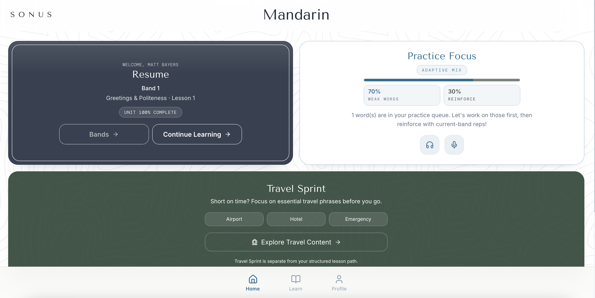
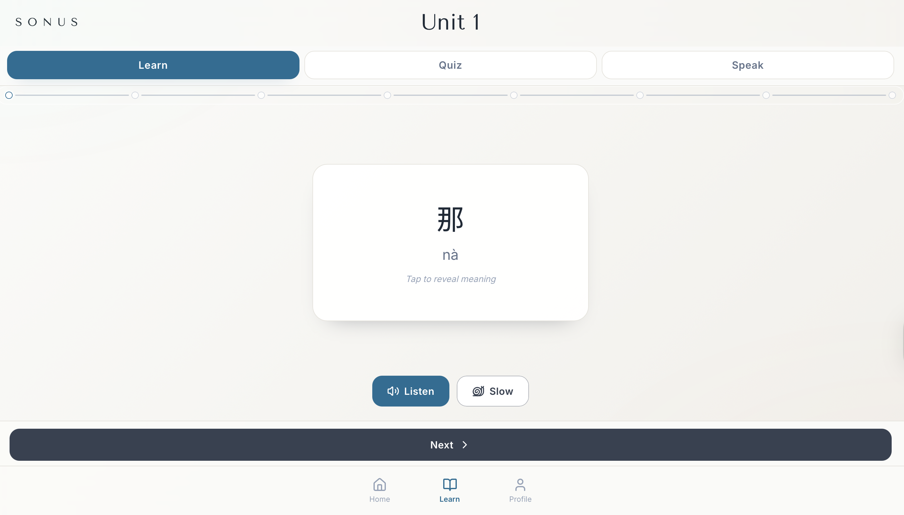
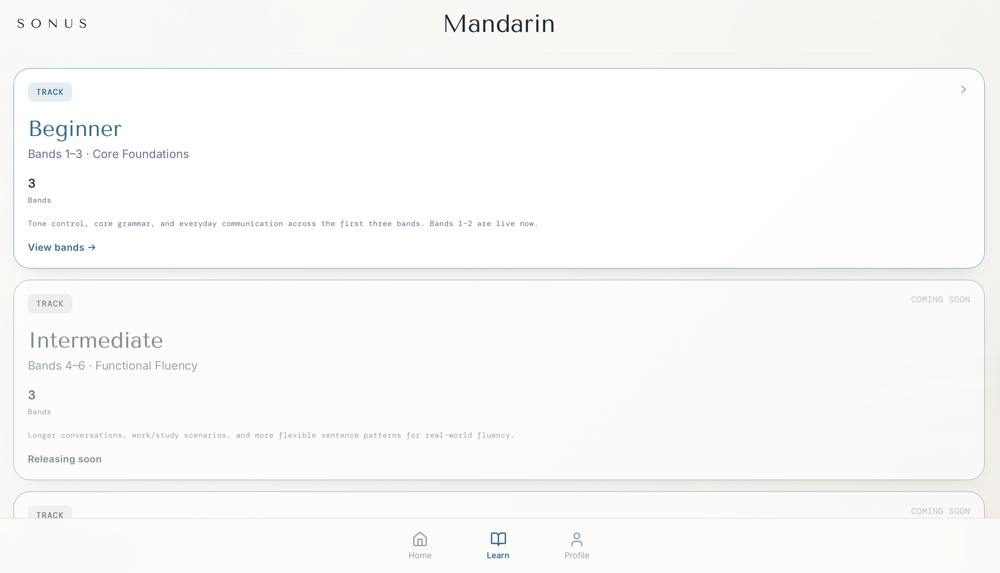
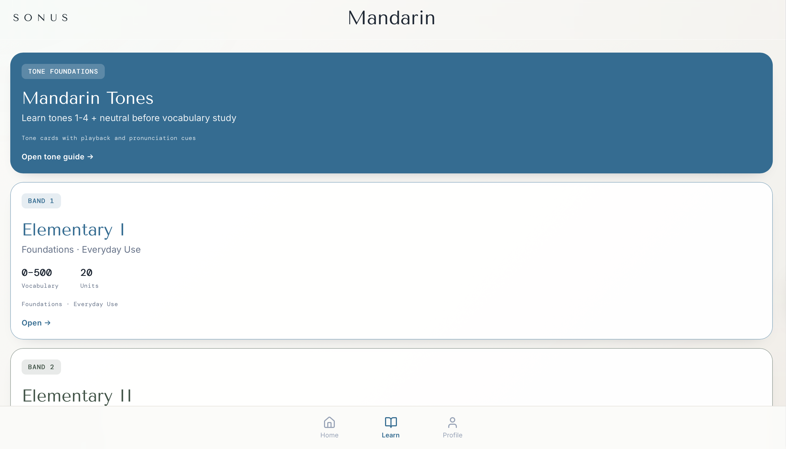
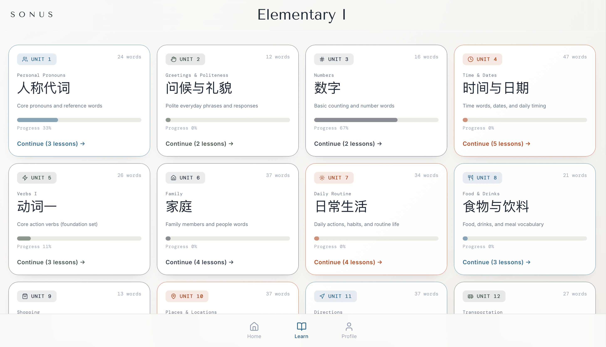
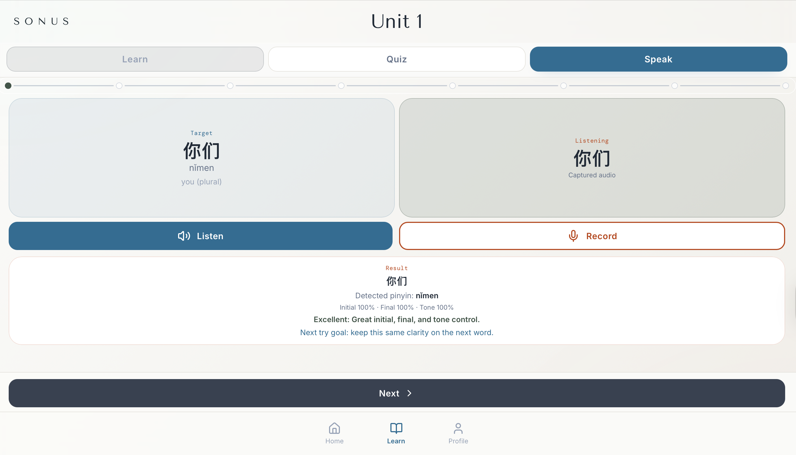

# Sonus Monorepo

Sonus is a Mandarin-first language learning platform focused on structured practice loops:
- `Learn` for vocabulary intake
- `Quiz` for recognition/comprehension
- `Speak` for pronunciation scoring (initial/final/tone)

This repository contains both the frontend application and backend API.

## Live Demo
- App: https://sonus-1.onrender.com

## Current Scope
- Multi-band lesson flow with unit/lesson structure
- Progress persistence and resume checkpoints
- Quiz and speaking attempt tracking
- Weak-word and spaced-review workflows
- Daily review set generation
- Listening and speaking practice tracks

## Repository Layout
- `sonus-react/` - React + Vite + TypeScript frontend
- `backend/` - Fastify + Prisma + TypeScript API
- `docs/` - product and engineering notes
- `scripts/` - project utilities and validation scripts
- `files/` - archived/source data assets

## Core Documentation
- `docs/ARCHITECTURE.md` - system boundaries and runtime flow
- `docs/API.md` - backend endpoint contract
- `docs/ENV.md` - environment variable reference
- `docs/PERFORMANCE.md` - baseline targets and measurement workflow
- `docs/PRODUCT_SETTINGS.md` - product-level defaults and settings

## Repository Hygiene Checklist
- Set GitHub repository `About` description and topics.
- Keep `docs/` references current when routes, env keys, or architecture change.
- Prefer route files for transport concerns and service files for business logic.
- Run quality gates before each push.

## Prerequisites
- Node.js 20+
- npm 10+
- PostgreSQL (local install or Docker)

## Local Setup
1. Install dependencies:
```bash
npm --prefix backend install
npm --prefix sonus-react install
```

2. Configure backend environment:
```bash
cp backend/.env.example backend/.env
```

3. Start PostgreSQL and sync schema:
```bash
npm --prefix backend run prisma:push
```

4. Run frontend and backend:
```bash
npm run dev:all
```

Local endpoints:
- Frontend: `http://127.0.0.1:5173`
- Backend: `http://127.0.0.1:4000`

## Root Scripts
- `npm run dev:frontend` - run frontend only
- `npm run dev:backend` - run backend only
- `npm run dev:all` - run frontend and backend together
- `npm run checklist` - run regression checklist helper
- `npm run test:core` - run backend core regression test

## Quality Gates
```bash
npm --prefix sonus-react run lint
npm --prefix sonus-react run build
npm --prefix backend run lint
npm --prefix backend run build
```

## Deployment Notes
- Frontend production builds use hash routing to avoid deep-link refresh failures on static hosts.
- If browser-history routing is reintroduced, host rewrites must direct unknown routes to `index.html`.

## Demo Assets
### Home


### Learn


### Flashcards


### Quiz


### Speak


### Progress


### Review

