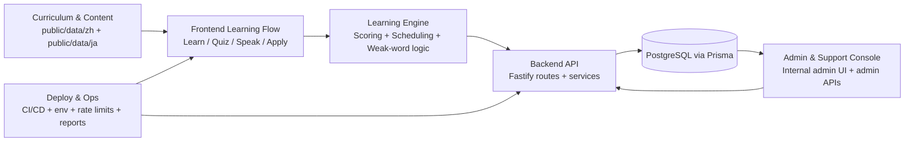

# Sonus System Overview

This is the high-level map of how Sonus fits together.

## One-Minute View

## How The Pieces Fit

### 1) Curriculum / Content
- Source lesson and phrase data is stored as versioned static JSON in `sonus-react/public/data/*`.
- This content defines bands, units, lesson words, and travel/use-case material.

### 2) Learning Engine / Scheduling
- The learning engine combines attempt outcomes (quiz/speak/apply) with review scheduling logic.
- It drives spaced review timing, weak-word prioritization, progression gating, and memory-state updates.
- Durable learning history is persisted via backend APIs and database models.

### 3) Frontend Learning Flow
- React routes and context orchestrate user flow through Learn, Quiz, Speak, and Apply modes.
- Frontend is responsible for interactive state and immediate UX decisions, while backend is source of durable state.

### 4) Admin / Support Tooling
- Internal support/admin surfaces run through dedicated admin routes.
- Admin actions (user lookups, interventions, reports, sensitive auth actions) are enforced server-side.
- Admin functions are role-gated, audited, and separated from learner-facing auth flows.
- Security and audit behavior are captured in admin/security event logs.

### 5) Deploy / Ops
- Runtime behavior is controlled by environment configuration (`docs/ENV.md`).
- Deployment and operational checks include quality reports, security checks, and rate-limit modes.
- The architecture supports local single-instance operation and production hardening patterns.

## End-to-End Request Path
1. User interacts with frontend learning mode.
2. Frontend calls backend API endpoints.
3. Backend applies auth, validation, business rules, and scheduling logic.
4. Data is read/written through Prisma to PostgreSQL.
5. Updated state/metrics feed back to learner UI and admin tooling.

## Read Next
- `docs/ARCHITECTURE.md` for detailed component-level breakdown.
- `docs/API.md` for endpoint-level behavior.
- `docs/ENV.md` for runtime/security configuration.
- `docs/ADMIN_SECURITY.md` for admin-path controls.
